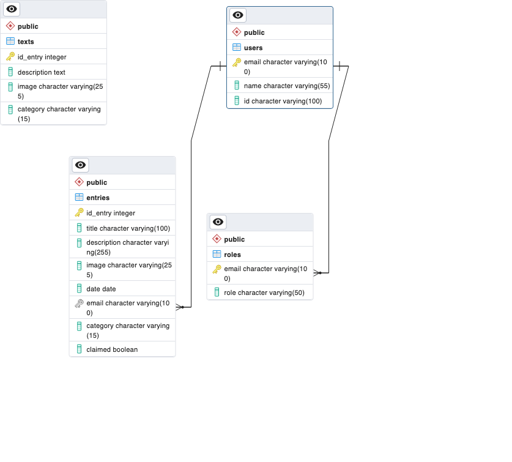
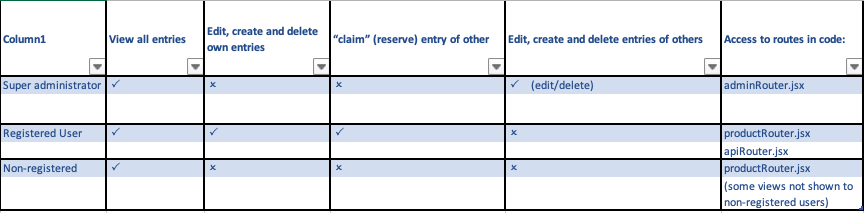

# Product swap

## To start project:

- Run 'yarn' to install all dependencies used (see note below)
- Run 'yarn dev' to start
- Configure environmental variables. Required variables can be found in .env.template file

NOTE: versions of dependencies different to those used here may cause conflicts. See list below (and package.json file) for dependencies and versions:

- "@auth0/auth0-react": "^2.0.2",
- "@reduxjs/toolkit": "^1.9.5",
- "documentation": "^14.0.1",
- "jsdoc": "^4.0.2",
- "nodemailer": "^6.9.1",
- "react": "^18.2.0",
- "react-dom": "^18.2.0",
- "react-hook-form": "^7.43.9",
- "react-redux": "^8.0.5",
- "react-router-dom": "^6.10.0",
- "redux": "^4.2.1"

## Related documents

API are used to send to and receive from data base. To read API documentation: https://documenter.getpostman.com/view/26092520/2s93eYTXQi

To see open-source backend code: https://github.com/dorian-rose/product-swap-back

Code is documented using JSDocs. To read documentation of code:

Deployed website can be viewed here:

## Database

Postgres SQL Elephant database has been used. The following schema demonstrates the tables used and their relations.

## Roles

Website users have accessibility to different parts of the site, depending on the permissions of their role. Three roles are used:

- 'Super' administrator
- Registered, logged user
- Non-registered user.

The following diagram indicates accessibility and permissions of each role.

### Users

Test user details are provided in order to explore app:

- ADMIN: pepe@correo.es Pass: QueVivaPepe2023

- User: jose@correo.es Pass: Abcd1234
- User: ana@correo.es Pass: Abcd1234
